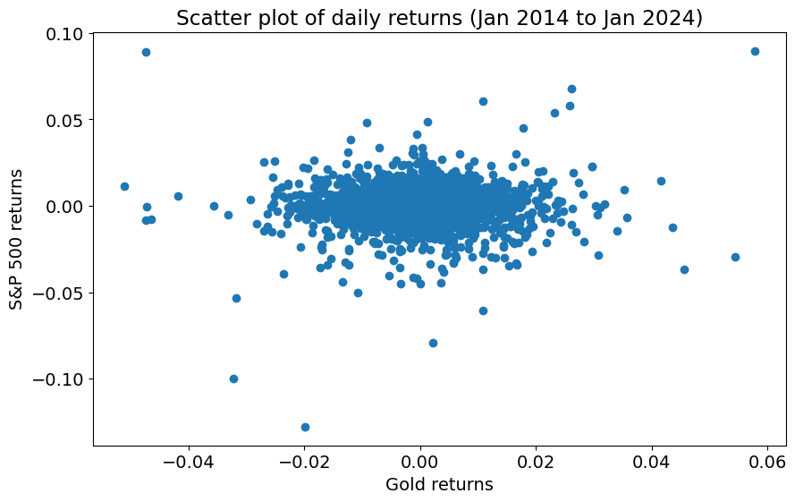

# Commodity-Price-Prediction-using-Statistical-Analysis
Commodity Price Prediction using Statistical Analysis
```python
### Import the required libraries

import numpy as np
import pandas as pd

import yfinance as yf
import datetime
import matplotlib.pyplot as plt

## To use statsmodels for linear regression
import statsmodels.formula.api as smf

## To use sklearn for linear regression
from sklearn.linear_model import LinearRegression
```


```python
# Imports

import seaborn as sns 
import matplotlib.pylab as plt
%matplotlib inline

from sklearn.linear_model import LinearRegression
from sklearn.metrics import r2_score
from sklearn.metrics import mean_squared_error

from sklearn.preprocessing import StandardScaler
from sklearn.preprocessing import PolynomialFeatures
from sklearn.model_selection import train_test_split

from sklearn.pipeline import Pipeline
from sklearn.model_selection import GridSearchCV

import json
import requests
import yfinance as yf

# import urllib3
# urllib3.disable_warnings(urllib3.exceptions.InsecureRequestWarning)

# # Alpha Vantage API key
# api_key = ...
```


```python
### Import the required libraries

import numpy as np
import pandas as pd

import yfinance as yf
import datetime
import matplotlib.pyplot as plt

## To use statsmodels for linear regression
import statsmodels.formula.api as smf

## To use sklearn for linear regression
from sklearn.linear_model import LinearRegression

```


```python


end1 = datetime.date(2024, 1, 31)
start1 = end1 - pd.Timedelta(days = 365 * 10)


```


```python
# ..222222..................
gold_df = yf.download("GC=F", start = start1, end = end1, progress = False)
crudeoil_df = yf.download("CL=F", start = start1, end = end1, progress = False)
gasoline_df = yf.download("RB=F", start = start1, end = end1, progress = False)
naturalgas_df = yf.download("NG=F", start = start1, end = end1, progress = False)
# uranium_df = yf.download("UX=F", start = start1, end = end1, progress = False)
snp500_df=yf.download("^SPX", start = start1, end = end1, progress = False)
silver_df=yf.download("SI=F", start = start1, end = end1, progress = False)
# copper_df=yf.download("HG", start = start1, end = end1, progress = False)
# cotton_df=yf.download("CT", start = start1, end = end1, progress = False)

# This formula calculates the logarithmic return, or log return, of the 'Adj Close' (Adjusted Close) prices in a DataFrame 
gold_df['GC'] = np.log(gold_df['Adj Close'] / gold_df['Adj Close'].shift(1))
crudeoil_df['CL'] = np.log(crudeoil_df['Adj Close'] / crudeoil_df['Adj Close'].shift(1))
gasoline_df['RB'] = np.log(gasoline_df['Adj Close'] / gasoline_df['Adj Close'].shift(1))
naturalgas_df['NG'] = np.log(naturalgas_df['Adj Close'] / naturalgas_df['Adj Close'].shift(1))
# uranium_df['UX'] = np.log(uranium_df['Adj Close'] /uranium_df['Adj Close'].shift(1))
snp500_df['SPX'] = np.log(snp500_df['Adj Close'] /snp500_df['Adj Close'].shift(1))
silver_df['SI'] = np.log(silver_df['Adj Close'] /silver_df['Adj Close'].shift(1))
# copper_df['HG'] = np.log(copper_df['Adj Close'] /copper_df['Adj Close'].shift(1))
# cotton_df['CT'] = np.log(cotton_df['Adj Close'] /cotton_df['Adj Close'].shift(1))

```

    C:\Users\91998\anaconda3\Lib\site-packages\pandas\core\arraylike.py:396: RuntimeWarning: invalid value encountered in log
      result = getattr(ufunc, method)(*inputs, **kwargs)
    


```python
silver_df
```


<div>
<style scoped>
    .dataframe tbody tr th:only-of-type {
        vertical-align: middle;
    }

    .dataframe tbody tr th {
        vertical-align: top;
    }

    .dataframe thead th {
        text-align: right;
    }
</style>
<table border="1" class="dataframe">
  <thead>
    <tr style="text-align: right;">
      <th></th>
      <th>Open</th>
      <th>High</th>
      <th>Low</th>
      <th>Close</th>
      <th>Adj Close</th>
      <th>Volume</th>
      <th>SI</th>
    </tr>
    <tr>
      <th>Date</th>
      <th></th>
      <th></th>
      <th></th>
      <th></th>
      <th></th>
      <th></th>
      <th></th>
    </tr>
  </thead>
  <tbody>
    <tr>
      <th>2014-02-03</th>
      <td>19.129999</td>
      <td>19.514999</td>
      <td>19.090000</td>
      <td>19.389000</td>
      <td>19.389000</td>
      <td>435</td>
      <td>NaN</td>
    </tr>
    <tr>
      <th>2014-02-04</th>
      <td>19.402000</td>
      <td>19.402000</td>
      <td>19.402000</td>
      <td>19.402000</td>
      <td>19.402000</td>
      <td>0</td>
      <td>0.000670</td>
    </tr>
    <tr>
      <th>2014-02-05</th>
      <td>19.745001</td>
      <td>20.045000</td>
      <td>19.745001</td>
      <td>19.785000</td>
      <td>19.785000</td>
      <td>4</td>
      <td>0.019548</td>
    </tr>
    <tr>
      <th>2014-02-06</th>
      <td>19.908001</td>
      <td>19.908001</td>
      <td>19.908001</td>
      <td>19.908001</td>
      <td>19.908001</td>
      <td>0</td>
      <td>0.006198</td>
    </tr>
    <tr>
      <th>2014-02-07</th>
      <td>19.920000</td>
      <td>19.920000</td>
      <td>19.920000</td>
      <td>19.920000</td>
      <td>19.920000</td>
      <td>0</td>
      <td>0.000603</td>
    </tr>
    <tr>
      <th>...</th>
      <td>...</td>
      <td>...</td>
      <td>...</td>
      <td>...</td>
      <td>...</td>
      <td>...</td>
      <td>...</td>
    </tr>
    <tr>
      <th>2024-01-24</th>
      <td>22.855000</td>
      <td>22.910000</td>
      <td>22.754999</td>
      <td>22.754999</td>
      <td>22.754999</td>
      <td>46</td>
      <td>0.018675</td>
    </tr>
    <tr>
      <th>2024-01-25</th>
      <td>22.870001</td>
      <td>22.870001</td>
      <td>22.808001</td>
      <td>22.808001</td>
      <td>22.808001</td>
      <td>48</td>
      <td>0.002327</td>
    </tr>
    <tr>
      <th>2024-01-26</th>
      <td>22.760000</td>
      <td>22.840000</td>
      <td>22.754999</td>
      <td>22.754999</td>
      <td>22.754999</td>
      <td>111</td>
      <td>-0.002327</td>
    </tr>
    <tr>
      <th>2024-01-29</th>
      <td>23.094999</td>
      <td>23.205000</td>
      <td>23.094999</td>
      <td>23.138000</td>
      <td>23.138000</td>
      <td>333</td>
      <td>0.016691</td>
    </tr>
    <tr>
      <th>2024-01-30</th>
      <td>23.205000</td>
      <td>23.275000</td>
      <td>23.065001</td>
      <td>23.107000</td>
      <td>23.107000</td>
      <td>78</td>
      <td>-0.001341</td>
    </tr>
  </tbody>
</table>
<p>2512 rows × 7 columns</p>
</div>


```python
naturalgas_df
```


<div>
<style scoped>
    .dataframe tbody tr th:only-of-type {
        vertical-align: middle;
    }

    .dataframe tbody tr th {
        vertical-align: top;
    }

    .dataframe thead th {
        text-align: right;
    }
</style>
<table border="1" class="dataframe">
  <thead>
    <tr style="text-align: right;">
      <th></th>
      <th>Open</th>
      <th>High</th>
      <th>Low</th>
      <th>Close</th>
      <th>Adj Close</th>
      <th>Volume</th>
      <th>NG</th>
    </tr>
    <tr>
      <th>Date</th>
      <th></th>
      <th></th>
      <th></th>
      <th></th>
      <th></th>
      <th></th>
      <th></th>
    </tr>
  </thead>
  <tbody>
    <tr>
      <th>2014-02-03</th>
      <td>4.850</td>
      <td>4.986</td>
      <td>4.751</td>
      <td>4.905</td>
      <td>4.905</td>
      <td>123163</td>
      <td>NaN</td>
    </tr>
    <tr>
      <th>2014-02-04</th>
      <td>4.953</td>
      <td>5.397</td>
      <td>4.942</td>
      <td>5.375</td>
      <td>5.375</td>
      <td>205520</td>
      <td>0.091503</td>
    </tr>
    <tr>
      <th>2014-02-05</th>
      <td>5.284</td>
      <td>5.737</td>
      <td>4.990</td>
      <td>5.030</td>
      <td>5.030</td>
      <td>256128</td>
      <td>-0.066339</td>
    </tr>
    <tr>
      <th>2014-02-06</th>
      <td>5.165</td>
      <td>5.396</td>
      <td>4.896</td>
      <td>4.931</td>
      <td>4.931</td>
      <td>200079</td>
      <td>-0.019878</td>
    </tr>
    <tr>
      <th>2014-02-07</th>
      <td>5.030</td>
      <td>5.049</td>
      <td>4.739</td>
      <td>4.775</td>
      <td>4.775</td>
      <td>188049</td>
      <td>-0.032148</td>
    </tr>
    <tr>
      <th>...</th>
      <td>...</td>
      <td>...</td>
      <td>...</td>
      <td>...</td>
      <td>...</td>
      <td>...</td>
      <td>...</td>
    </tr>
    <tr>
      <th>2024-01-24</th>
      <td>2.498</td>
      <td>2.696</td>
      <td>2.495</td>
      <td>2.641</td>
      <td>2.641</td>
      <td>65497</td>
      <td>0.075070</td>
    </tr>
    <tr>
      <th>2024-01-25</th>
      <td>2.683</td>
      <td>2.884</td>
      <td>2.526</td>
      <td>2.571</td>
      <td>2.571</td>
      <td>44984</td>
      <td>-0.026863</td>
    </tr>
    <tr>
      <th>2024-01-26</th>
      <td>2.607</td>
      <td>2.804</td>
      <td>2.424</td>
      <td>2.712</td>
      <td>2.712</td>
      <td>73015</td>
      <td>0.053391</td>
    </tr>
    <tr>
      <th>2024-01-29</th>
      <td>2.680</td>
      <td>2.760</td>
      <td>2.411</td>
      <td>2.490</td>
      <td>2.490</td>
      <td>164621</td>
      <td>-0.085404</td>
    </tr>
    <tr>
      <th>2024-01-30</th>
      <td>2.060</td>
      <td>2.119</td>
      <td>2.046</td>
      <td>2.077</td>
      <td>2.077</td>
      <td>139745</td>
      <td>-0.181358</td>
    </tr>
  </tbody>
</table>
<p>2514 rows × 7 columns</p>
</div>


```python
gasoline_df 
```


<div>
<style scoped>
    .dataframe tbody tr th:only-of-type {
        vertical-align: middle;
    }

    .dataframe tbody tr th {
        vertical-align: top;
    }

    .dataframe thead th {
        text-align: right;
    }
</style>
<table border="1" class="dataframe">
  <thead>
    <tr style="text-align: right;">
      <th></th>
      <th>Open</th>
      <th>High</th>
      <th>Low</th>
      <th>Close</th>
      <th>Adj Close</th>
      <th>Volume</th>
      <th>RB</th>
    </tr>
    <tr>
      <th>Date</th>
      <th></th>
      <th></th>
      <th></th>
      <th></th>
      <th></th>
      <th></th>
      <th></th>
    </tr>
  </thead>
  <tbody>
    <tr>
      <th>2014-02-03</th>
      <td>2.6385</td>
      <td>2.6440</td>
      <td>2.5942</td>
      <td>2.6069</td>
      <td>2.6069</td>
      <td>53483</td>
      <td>NaN</td>
    </tr>
    <tr>
      <th>2014-02-04</th>
      <td>2.6101</td>
      <td>2.6181</td>
      <td>2.5969</td>
      <td>2.6031</td>
      <td>2.6031</td>
      <td>45723</td>
      <td>-0.001459</td>
    </tr>
    <tr>
      <th>2014-02-05</th>
      <td>2.6136</td>
      <td>2.6479</td>
      <td>2.6078</td>
      <td>2.6413</td>
      <td>2.6413</td>
      <td>53961</td>
      <td>0.014568</td>
    </tr>
    <tr>
      <th>2014-02-06</th>
      <td>2.6446</td>
      <td>2.6892</td>
      <td>2.6446</td>
      <td>2.6830</td>
      <td>2.6830</td>
      <td>56228</td>
      <td>0.015664</td>
    </tr>
    <tr>
      <th>2014-02-07</th>
      <td>2.6880</td>
      <td>2.7537</td>
      <td>2.6756</td>
      <td>2.7489</td>
      <td>2.7489</td>
      <td>64956</td>
      <td>0.024265</td>
    </tr>
    <tr>
      <th>...</th>
      <td>...</td>
      <td>...</td>
      <td>...</td>
      <td>...</td>
      <td>...</td>
      <td>...</td>
      <td>...</td>
    </tr>
    <tr>
      <th>2024-01-24</th>
      <td>2.2053</td>
      <td>2.2457</td>
      <td>2.1902</td>
      <td>2.2095</td>
      <td>2.2095</td>
      <td>31631</td>
      <td>-0.000271</td>
    </tr>
    <tr>
      <th>2024-01-25</th>
      <td>2.2184</td>
      <td>2.2671</td>
      <td>2.2122</td>
      <td>2.2644</td>
      <td>2.2644</td>
      <td>25523</td>
      <td>0.024544</td>
    </tr>
    <tr>
      <th>2024-01-26</th>
      <td>2.2637</td>
      <td>2.3069</td>
      <td>2.2271</td>
      <td>2.2941</td>
      <td>2.2941</td>
      <td>20516</td>
      <td>0.013031</td>
    </tr>
    <tr>
      <th>2024-01-29</th>
      <td>2.3068</td>
      <td>2.3170</td>
      <td>2.2178</td>
      <td>2.2285</td>
      <td>2.2285</td>
      <td>15006</td>
      <td>-0.029012</td>
    </tr>
    <tr>
      <th>2024-01-30</th>
      <td>2.2151</td>
      <td>2.2654</td>
      <td>2.1718</td>
      <td>2.2607</td>
      <td>2.2607</td>
      <td>14514</td>
      <td>0.014346</td>
    </tr>
  </tbody>
</table>
<p>2514 rows × 7 columns</p>
</div>


```python
crudeoil_df 
```


<div>
<style scoped>
    .dataframe tbody tr th:only-of-type {
        vertical-align: middle;
    }

    .dataframe tbody tr th {
        vertical-align: top;
    }

    .dataframe thead th {
        text-align: right;
    }
</style>
<table border="1" class="dataframe">
  <thead>
    <tr style="text-align: right;">
      <th></th>
      <th>Open</th>
      <th>High</th>
      <th>Low</th>
      <th>Close</th>
      <th>Adj Close</th>
      <th>Volume</th>
      <th>CL</th>
    </tr>
    <tr>
      <th>Date</th>
      <th></th>
      <th></th>
      <th></th>
      <th></th>
      <th></th>
      <th></th>
      <th></th>
    </tr>
  </thead>
  <tbody>
    <tr>
      <th>2014-02-03</th>
      <td>97.400002</td>
      <td>97.940002</td>
      <td>96.260002</td>
      <td>96.430000</td>
      <td>96.430000</td>
      <td>293312</td>
      <td>NaN</td>
    </tr>
    <tr>
      <th>2014-02-04</th>
      <td>96.529999</td>
      <td>97.820000</td>
      <td>96.370003</td>
      <td>97.190002</td>
      <td>97.190002</td>
      <td>204282</td>
      <td>0.007850</td>
    </tr>
    <tr>
      <th>2014-02-05</th>
      <td>97.669998</td>
      <td>98.260002</td>
      <td>96.800003</td>
      <td>97.379997</td>
      <td>97.379997</td>
      <td>237671</td>
      <td>0.001953</td>
    </tr>
    <tr>
      <th>2014-02-06</th>
      <td>97.250000</td>
      <td>98.830002</td>
      <td>97.250000</td>
      <td>97.839996</td>
      <td>97.839996</td>
      <td>234281</td>
      <td>0.004713</td>
    </tr>
    <tr>
      <th>2014-02-07</th>
      <td>97.970001</td>
      <td>100.239998</td>
      <td>97.110001</td>
      <td>99.879997</td>
      <td>99.879997</td>
      <td>270407</td>
      <td>0.020636</td>
    </tr>
    <tr>
      <th>...</th>
      <td>...</td>
      <td>...</td>
      <td>...</td>
      <td>...</td>
      <td>...</td>
      <td>...</td>
      <td>...</td>
    </tr>
    <tr>
      <th>2024-01-24</th>
      <td>74.570000</td>
      <td>75.830002</td>
      <td>73.940002</td>
      <td>75.089996</td>
      <td>75.089996</td>
      <td>323726</td>
      <td>0.009635</td>
    </tr>
    <tr>
      <th>2024-01-25</th>
      <td>75.300003</td>
      <td>77.510002</td>
      <td>75.160004</td>
      <td>77.360001</td>
      <td>77.360001</td>
      <td>320177</td>
      <td>0.029783</td>
    </tr>
    <tr>
      <th>2024-01-26</th>
      <td>77.150002</td>
      <td>78.260002</td>
      <td>76.059998</td>
      <td>78.010002</td>
      <td>78.010002</td>
      <td>365456</td>
      <td>0.008367</td>
    </tr>
    <tr>
      <th>2024-01-29</th>
      <td>78.900002</td>
      <td>79.290001</td>
      <td>76.410004</td>
      <td>76.779999</td>
      <td>76.779999</td>
      <td>331925</td>
      <td>-0.015893</td>
    </tr>
    <tr>
      <th>2024-01-30</th>
      <td>77.019997</td>
      <td>78.139999</td>
      <td>75.849998</td>
      <td>77.820000</td>
      <td>77.820000</td>
      <td>347242</td>
      <td>0.013454</td>
    </tr>
  </tbody>
</table>
<p>2514 rows × 7 columns</p>
</div>


```python
gold_df
```


<div>
<style scoped>
    .dataframe tbody tr th:only-of-type {
        vertical-align: middle;
    }

    .dataframe tbody tr th {
        vertical-align: top;
    }

    .dataframe thead th {
        text-align: right;
    }
</style>
<table border="1" class="dataframe">
  <thead>
    <tr style="text-align: right;">
      <th></th>
      <th>Open</th>
      <th>High</th>
      <th>Low</th>
      <th>Close</th>
      <th>Adj Close</th>
      <th>Volume</th>
      <th>GC</th>
    </tr>
    <tr>
      <th>Date</th>
      <th></th>
      <th></th>
      <th></th>
      <th></th>
      <th></th>
      <th></th>
      <th></th>
    </tr>
  </thead>
  <tbody>
    <tr>
      <th>2014-02-03</th>
      <td>1242.400024</td>
      <td>1266.300049</td>
      <td>1241.199951</td>
      <td>1260.400024</td>
      <td>1260.400024</td>
      <td>2914</td>
      <td>NaN</td>
    </tr>
    <tr>
      <th>2014-02-04</th>
      <td>1258.400024</td>
      <td>1260.699951</td>
      <td>1247.800049</td>
      <td>1251.699951</td>
      <td>1251.699951</td>
      <td>1745</td>
      <td>-0.006927</td>
    </tr>
    <tr>
      <th>2014-02-05</th>
      <td>1254.000000</td>
      <td>1273.699951</td>
      <td>1253.099976</td>
      <td>1257.300049</td>
      <td>1257.300049</td>
      <td>1616</td>
      <td>0.004464</td>
    </tr>
    <tr>
      <th>2014-02-06</th>
      <td>1258.000000</td>
      <td>1267.000000</td>
      <td>1253.500000</td>
      <td>1257.599976</td>
      <td>1257.599976</td>
      <td>274</td>
      <td>0.000239</td>
    </tr>
    <tr>
      <th>2014-02-07</th>
      <td>1258.300049</td>
      <td>1271.400024</td>
      <td>1257.900024</td>
      <td>1263.300049</td>
      <td>1263.300049</td>
      <td>436</td>
      <td>0.004522</td>
    </tr>
    <tr>
      <th>...</th>
      <td>...</td>
      <td>...</td>
      <td>...</td>
      <td>...</td>
      <td>...</td>
      <td>...</td>
      <td>...</td>
    </tr>
    <tr>
      <th>2024-01-24</th>
      <td>2023.199951</td>
      <td>2033.199951</td>
      <td>2013.900024</td>
      <td>2013.900024</td>
      <td>2013.900024</td>
      <td>253</td>
      <td>-0.004854</td>
    </tr>
    <tr>
      <th>2024-01-25</th>
      <td>2012.099976</td>
      <td>2022.400024</td>
      <td>2012.099976</td>
      <td>2016.900024</td>
      <td>2016.900024</td>
      <td>548</td>
      <td>0.001489</td>
    </tr>
    <tr>
      <th>2024-01-26</th>
      <td>2021.699951</td>
      <td>2022.400024</td>
      <td>2016.800049</td>
      <td>2016.800049</td>
      <td>2016.800049</td>
      <td>49</td>
      <td>-0.000050</td>
    </tr>
    <tr>
      <th>2024-01-29</th>
      <td>2025.199951</td>
      <td>2025.199951</td>
      <td>2025.199951</td>
      <td>2025.199951</td>
      <td>2025.199951</td>
      <td>150708</td>
      <td>0.004156</td>
    </tr>
    <tr>
      <th>2024-01-30</th>
      <td>2032.500000</td>
      <td>2048.500000</td>
      <td>2028.099976</td>
      <td>2031.500000</td>
      <td>2031.500000</td>
      <td>26907</td>
      <td>0.003106</td>
    </tr>
  </tbody>
</table>
<p>2513 rows × 7 columns</p>
</div>


```python
snp500_df
```


<div>
<style scoped>
    .dataframe tbody tr th:only-of-type {
        vertical-align: middle;
    }

    .dataframe tbody tr th {
        vertical-align: top;
    }

    .dataframe thead th {
        text-align: right;
    }
</style>
<table border="1" class="dataframe">
  <thead>
    <tr style="text-align: right;">
      <th></th>
      <th>Open</th>
      <th>High</th>
      <th>Low</th>
      <th>Close</th>
      <th>Adj Close</th>
      <th>Volume</th>
      <th>SPX</th>
    </tr>
    <tr>
      <th>Date</th>
      <th></th>
      <th></th>
      <th></th>
      <th></th>
      <th></th>
      <th></th>
      <th></th>
    </tr>
  </thead>
  <tbody>
    <tr>
      <th>2014-02-03</th>
      <td>1782.680054</td>
      <td>1784.829956</td>
      <td>1739.660034</td>
      <td>1741.890015</td>
      <td>1741.890015</td>
      <td>4726040000</td>
      <td>NaN</td>
    </tr>
    <tr>
      <th>2014-02-04</th>
      <td>1743.819946</td>
      <td>1758.729980</td>
      <td>1743.819946</td>
      <td>1755.199951</td>
      <td>1755.199951</td>
      <td>4068410000</td>
      <td>0.007612</td>
    </tr>
    <tr>
      <th>2014-02-05</th>
      <td>1753.380005</td>
      <td>1755.790039</td>
      <td>1737.920044</td>
      <td>1751.640015</td>
      <td>1751.640015</td>
      <td>3984290000</td>
      <td>-0.002030</td>
    </tr>
    <tr>
      <th>2014-02-06</th>
      <td>1752.989990</td>
      <td>1774.060059</td>
      <td>1752.989990</td>
      <td>1773.430054</td>
      <td>1773.430054</td>
      <td>3825410000</td>
      <td>0.012363</td>
    </tr>
    <tr>
      <th>2014-02-07</th>
      <td>1776.010010</td>
      <td>1798.030029</td>
      <td>1776.010010</td>
      <td>1797.020020</td>
      <td>1797.020020</td>
      <td>3775990000</td>
      <td>0.013214</td>
    </tr>
    <tr>
      <th>...</th>
      <td>...</td>
      <td>...</td>
      <td>...</td>
      <td>...</td>
      <td>...</td>
      <td>...</td>
      <td>...</td>
    </tr>
    <tr>
      <th>2024-01-24</th>
      <td>4888.560059</td>
      <td>4903.680176</td>
      <td>4865.939941</td>
      <td>4868.549805</td>
      <td>4868.549805</td>
      <td>4330030000</td>
      <td>0.000812</td>
    </tr>
    <tr>
      <th>2024-01-25</th>
      <td>4886.660156</td>
      <td>4898.149902</td>
      <td>4869.339844</td>
      <td>4894.160156</td>
      <td>4894.160156</td>
      <td>4020430000</td>
      <td>0.005247</td>
    </tr>
    <tr>
      <th>2024-01-26</th>
      <td>4888.910156</td>
      <td>4906.689941</td>
      <td>4881.470215</td>
      <td>4890.970215</td>
      <td>4890.970215</td>
      <td>3353400000</td>
      <td>-0.000652</td>
    </tr>
    <tr>
      <th>2024-01-29</th>
      <td>4892.950195</td>
      <td>4929.310059</td>
      <td>4887.399902</td>
      <td>4927.930176</td>
      <td>4927.930176</td>
      <td>3525160000</td>
      <td>0.007528</td>
    </tr>
    <tr>
      <th>2024-01-30</th>
      <td>4925.890137</td>
      <td>4931.089844</td>
      <td>4916.270020</td>
      <td>4924.970215</td>
      <td>4924.970215</td>
      <td>3836130000</td>
      <td>-0.000601</td>
    </tr>
  </tbody>
</table>
<p>2515 rows × 7 columns</p>
</div>


```python
gold_df['Close'].plot()
# crudeoil_df['CL'].plot()
# gasoline_df['RB'].plot()
# naturalgas_df['NG'].plot()
snp500_df['Close'].plot()
# gold_df['Close'].plot()
# silver_df['Close'].plot()
# copper_df['Close'].plot()
# cotton_df['Close'].plot()

```


    <Axes: xlabel='Date'>


    

    


```python
import matplotlib.pyplot as plt

# Plotting the closing prices
plt.figure(figsize=(10, 6))  # Set the figure size

# Plotting S&P 500 closing prices
snp500_df['Close'].plot(label='S&P 500')

# Plotting gold closing prices
gold_df['Close'].plot(label='Gold')
silver_df['Close'].plot(label='Silver')

# Plotting copper closing prices
crudeoil_df['Close'].plot(label='Crude Oil')

gasoline_df['Close'].plot(label="Gasoline")

naturalgas_df['Close'].plot(label="Natural Gas")


# Adding legend
plt.legend()

# Adding chart title
plt.title(' Price Comparison')

# Adding axis labels
plt.xlabel('Date')
plt.ylabel('Price')

# Show plot
plt.show()
```


    

    


```python
# Concatenate the closing prices of all stocks into a single DataFrame
closing_prices = pd.concat([snp500_df['Close'], gold_df['Close'], silver_df['Close'], crudeoil_df['Close'], gasoline_df['Close'], naturalgas_df['Close']], axis=1)
closing_prices.columns = ['S&P 500', 'Gold', 'Silver', 'Crude Oil', 'Gasoline', 'Natural Gas']

# Calculate the five-number summary
five_num_summary = closing_prices.describe().loc[['min', '25%', '50%', '75%', 'max']]

# Print the five-number summary
print("Five-Number Summary:")
print(five_num_summary)

```

    Five-Number Summary:
             S&P 500         Gold     Silver   Crude Oil  Gasoline  Natural Gas
    min  1741.890015  1050.800049  11.735000  -37.630001  0.411800      1.48200
    25%  2138.140015  1248.000000  16.215750   48.520000  1.520800      2.54525
    50%  2809.919922  1332.800049  17.772500   59.660000  1.882350      2.85400
    75%  3929.470093  1799.400024  22.676000   75.942499  2.308275      3.65625
    max  4927.930176  2081.899902  29.398001  123.699997  4.276200      9.68000
    


```python
import matplotlib.pyplot as plt

# Plotting the closing prices
plt.figure(figsize=(10, 6))  # Set the figure size

# Plotting S&P 500 closing prices
snp500_df['Close'].plot(label='S&P 500')

# Plotting gold closing prices
gold_df['Close'].plot(label='Gold')


# Adding legend
plt.legend()

# Adding chart title
plt.title(' Price Comparison')

# Adding axis labels
plt.xlabel('Date')
plt.ylabel('Price')

# Show plot
plt.show()

```


    

    


```python
# Concatenate the closing prices of all stocks into a single DataFrame
closing_prices = pd.concat([snp500_df['Close'], gold_df['Close'], silver_df['Close'], crudeoil_df['Close'], gasoline_df['Close'], naturalgas_df['Close']], axis=1)
closing_prices.columns = ['S&P 500', 'Gold', 'Silver', 'Crude Oil', 'Gasoline', 'Natural Gas']

# Calculate the correlation matrix
correlation_matrix = closing_prices.corr()

# Print the correlation matrix
print("Correlation Matrix:")
print(correlation_matrix)

```

    Correlation Matrix:
                  S&P 500      Gold    Silver  Crude Oil  Gasoline  Natural Gas
    S&P 500      1.000000  0.905760  0.743671   0.381841  0.417642     0.294176
    Gold         0.905760  1.000000  0.849675   0.318318  0.351067     0.210280
    Silver       0.743671  0.849675  1.000000   0.401098  0.406811     0.236944
    Crude Oil    0.381841  0.318318  0.401098   1.000000  0.957165     0.696950
    Gasoline     0.417642  0.351067  0.406811   0.957165  1.000000     0.685251
    Natural Gas  0.294176  0.210280  0.236944   0.696950  0.685251     1.000000
    


```python
import seaborn as sns
import matplotlib.pyplot as plt

# Calculate the correlation matrix
correlation_matrix = closing_prices.corr()

# Create a heatmap
plt.figure(figsize=(10, 8))
sns.heatmap(correlation_matrix, annot=True, cmap='coolwarm', fmt=".2f", square=True)

# Add title and display the plot
plt.title('Correlation Matrix of Closing Prices')
plt.show()

```


    

    


```python
plt.figure(figsize=(10, 6))
# Plotting silver closing prices
silver_df['Close'].plot(label='Silver')

# Plotting copper closing prices
crudeoil_df['Close'].plot(label='Crude Oil')

gasoline_df['Close'].plot(label="Gasoline")

naturalgas_df['Close'].plot(label="Natural Gas")
# Adding legend
plt.legend()

# Adding chart title
plt.title('Prices Comparison')

# Adding axis labels
plt.xlabel('Date')
plt.ylabel('Price')

# Show plot
plt.show()
```


    

    


```python

silver_df['Close'].plot()
```


    <Axes: xlabel='Date'>


    

    


```python
gold_df['Close'].plot()
```


    <Axes: xlabel='Date'>


    

    


```python
# ....2.222222222222222222222


dataFrame = pd.concat([gold_df['GC'], crudeoil_df['CL'], snp500_df['SPX'],
               gasoline_df['RB'],naturalgas_df['NG'],silver_df['SI']], axis = 1).dropna()

## Save the csv file. Good practice to save data files after initial processing
dataFrame.to_csv("Jan 2024_data_lin_regression.csv")
```


```python
dataFrame.head()
```


<div>
<style scoped>
    .dataframe tbody tr th:only-of-type {
        vertical-align: middle;
    }

    .dataframe tbody tr th {
        vertical-align: top;
    }

    .dataframe thead th {
        text-align: right;
    }
</style>
<table border="1" class="dataframe">
  <thead>
    <tr style="text-align: right;">
      <th></th>
      <th>GC</th>
      <th>CL</th>
      <th>SPX</th>
      <th>RB</th>
      <th>NG</th>
      <th>SI</th>
    </tr>
    <tr>
      <th>Date</th>
      <th></th>
      <th></th>
      <th></th>
      <th></th>
      <th></th>
      <th></th>
    </tr>
  </thead>
  <tbody>
    <tr>
      <th>2014-02-04</th>
      <td>-0.006927</td>
      <td>0.007850</td>
      <td>0.007612</td>
      <td>-0.001459</td>
      <td>0.091503</td>
      <td>0.000670</td>
    </tr>
    <tr>
      <th>2014-02-05</th>
      <td>0.004464</td>
      <td>0.001953</td>
      <td>-0.002030</td>
      <td>0.014568</td>
      <td>-0.066339</td>
      <td>0.019548</td>
    </tr>
    <tr>
      <th>2014-02-06</th>
      <td>0.000239</td>
      <td>0.004713</td>
      <td>0.012363</td>
      <td>0.015664</td>
      <td>-0.019878</td>
      <td>0.006198</td>
    </tr>
    <tr>
      <th>2014-02-07</th>
      <td>0.004522</td>
      <td>0.020636</td>
      <td>0.013214</td>
      <td>0.024265</td>
      <td>-0.032148</td>
      <td>0.000603</td>
    </tr>
    <tr>
      <th>2014-02-10</th>
      <td>0.009062</td>
      <td>0.001801</td>
      <td>0.001568</td>
      <td>-0.008806</td>
      <td>-0.041913</td>
      <td>0.008946</td>
    </tr>
  </tbody>
</table>
</div>


```python
# print(gold_df['GC'])
# print(crudeoil_df['CL'])
# print( gasoline_df['RB'])
# print(naturalgas_df['NG'])

```


```python
plt.figure(figsize = (10, 6))
plt.rcParams.update({'font.size': 14})
plt.xlabel("Gold returns")
plt.ylabel("S&P 500 returns")
plt.title("Scatter plot of daily returns (Jan 2014 to Jan 2024)")
plt.scatter(dataFrame['GC'], dataFrame['SPX'])
plt.show()
```


    

    


```python
####################################################
## 1. Calculate correlation between Xs and Y

# df.corr()
```


```python
# .2222222222222

dataFrame.corr()
```


<div>
<style scoped>
    .dataframe tbody tr th:only-of-type {
        vertical-align: middle;
    }

    .dataframe tbody tr th {
        vertical-align: top;
    }

    .dataframe thead th {
        text-align: right;
    }
</style>
<table border="1" class="dataframe">
  <thead>
    <tr style="text-align: right;">
      <th></th>
      <th>GC</th>
      <th>CL</th>
      <th>SPX</th>
      <th>RB</th>
      <th>NG</th>
    </tr>
  </thead>
  <tbody>
    <tr>
      <th>GC</th>
      <td>1.000000</td>
      <td>0.097851</td>
      <td>0.010732</td>
      <td>0.065453</td>
      <td>0.001231</td>
    </tr>
    <tr>
      <th>CL</th>
      <td>0.097851</td>
      <td>1.000000</td>
      <td>0.253148</td>
      <td>0.672705</td>
      <td>0.106307</td>
    </tr>
    <tr>
      <th>SPX</th>
      <td>0.010732</td>
      <td>0.253148</td>
      <td>1.000000</td>
      <td>0.327365</td>
      <td>0.082027</td>
    </tr>
    <tr>
      <th>RB</th>
      <td>0.065453</td>
      <td>0.672705</td>
      <td>0.327365</td>
      <td>1.000000</td>
      <td>0.102370</td>
    </tr>
    <tr>
      <th>NG</th>
      <td>0.001231</td>
      <td>0.106307</td>
      <td>0.082027</td>
      <td>0.102370</td>
      <td>1.000000</td>
    </tr>
  </tbody>
</table>
</div>


```python
# ..22222222222222222222

####################################################
## 2a. Fit a simple linear regression model to the data using statsmodels 

### Create an instance of the class 
slr_sm_model = smf.ols('GC ~ CL', data=dataFrame)

### Fit the model (statsmodels calculates beta_0 and beta_1 here)
slr_sm_model_gold = slr_sm_model.fit()

### Summarize the model

print(slr_sm_model_gold.summary()) 

param_slr = slr_sm_model_gold.params

```

                                OLS Regression Results                            
    ==============================================================================
    Dep. Variable:                     GC   R-squared:                       0.010
    Model:                            OLS   Adj. R-squared:                  0.009
    Method:                 Least Squares   F-statistic:                     24.24
    Date:                Mon, 22 Apr 2024   Prob (F-statistic):           9.07e-07
    Time:                        20:32:57   Log-Likelihood:                 8222.8
    No. Observations:                2509   AIC:                        -1.644e+04
    Df Residuals:                    2507   BIC:                        -1.643e+04
    Df Model:                           1                                         
    Covariance Type:            nonrobust                                         
    ==============================================================================
                     coef    std err          t      P>|t|      [0.025      0.975]
    ------------------------------------------------------------------------------
    Intercept      0.0002      0.000      1.030      0.303      -0.000       0.001
    CL             0.0309      0.006      4.923      0.000       0.019       0.043
    ==============================================================================
    Omnibus:                      232.105   Durbin-Watson:                   2.056
    Prob(Omnibus):                  0.000   Jarque-Bera (JB):             1612.202
    Skew:                          -0.002   Prob(JB):                         0.00
    Kurtosis:                       6.927   Cond. No.                         34.4
    ==============================================================================
    
    Notes:
    [1] Standard Errors assume that the covariance matrix of the errors is correctly specified.
    


```python
# .....22222222222222

####################################################
### Print the parameter estimates of the simple linear regression model

print("\n")
print("====================================================================")
print("The intercept in the statsmodels regression model is", \
      np.round(param_slr.Intercept, 4))
print("The slope in the statsmodels regression model is", \
      np.round(param_slr.CL, 4))
print("====================================================================")
print("\n")
```

    
    
    ====================================================================
    The intercept in the statsmodels regression model is 0.0002
    The slope in the statsmodels regression model is 0.0309
    ====================================================================
    
    
    


```python
####################################################
## 2a. Fit a simple linear regression model to the data using statsmodels 

### Create an instance of the class 
slr_sm_model = smf.ols('GC ~ SPX', data=dataFrame)

### Fit the model (statsmodels calculates beta_0 and beta_1 here)
slr_sm_model_gold = slr_sm_model.fit()

### Summarize the model

print(slr_sm_model_gold.summary()) 

param_slr = slr_sm_model_gold.params

```

                                OLS Regression Results                            
    ==============================================================================
    Dep. Variable:                     GC   R-squared:                       0.000
    Model:                            OLS   Adj. R-squared:                 -0.000
    Method:                 Least Squares   F-statistic:                    0.2888
    Date:                Mon, 22 Apr 2024   Prob (F-statistic):              0.591
    Time:                        20:33:11   Log-Likelihood:                 8210.8
    No. Observations:                2509   AIC:                        -1.642e+04
    Df Residuals:                    2507   BIC:                        -1.641e+04
    Df Model:                           1                                         
    Covariance Type:            nonrobust                                         
    ==============================================================================
                     coef    std err          t      P>|t|      [0.025      0.975]
    ------------------------------------------------------------------------------
    Intercept      0.0002      0.000      1.031      0.303      -0.000       0.001
    SPX            0.0088      0.016      0.537      0.591      -0.023       0.041
    ==============================================================================
    Omnibus:                      229.778   Durbin-Watson:                   2.056
    Prob(Omnibus):                  0.000   Jarque-Bera (JB):             1572.743
    Skew:                          -0.018   Prob(JB):                         0.00
    Kurtosis:                       6.879   Cond. No.                         89.5
    ==============================================================================
    
    Notes:
    [1] Standard Errors assume that the covariance matrix of the errors is correctly specified.
    


```python
# dataFrame["^SPX"]
```


```python
print("\n")
print("====================================================================")
print("The intercept in the statsmodels regression model is", \
      np.round(param_slr.Intercept, 4))
print("The slope in the statsmodels regression model is", \
      np.round(param_slr.SPX, 4))
print("====================================================================")
print("\n")
```

    
    
    ====================================================================
    The intercept in the statsmodels regression model is 0.0002
    The slope in the statsmodels regression model is 0.0088
    ====================================================================
    
    
    


```python
# ..........2222222222222
####################################################
## Linear regression plot of X (spy) and Y (gold)
plt.figure(figsize = (10, 6))
plt.rcParams.update({'font.size': 14})
plt.xlabel(" S&P 500 returns")
plt.ylabel("Gold returns")
plt.title("Simple linear regression model")
plt.scatter(dataFrame['SPX'],dataFrame['GC'])
plt.plot(dataFrame['SPX'], param_slr.Intercept+param_slr.SPX * dataFrame['SPX'],
         label='Y={:.4f}+{:.4f}X'.format(param_slr.Intercept, param_slr.SPX), 
         color='red')
plt.legend()
plt.show()
```


    

    


```python
# .222222222222222222222


####################################################
### Fit a multiple linear regression model to the data using statsmodels    

### Create an instance of the class OLS
mlr_sm_model = smf.ols('GC ~ CL + RB + NG ', data=dataFrame)

### Fit the model (statsmodels calculates beta_0, beta_1, beta_2, beta_3 here)
mlr_sm_model_gold = mlr_sm_model.fit()

### Summarize the model

print(mlr_sm_model_gold.summary())
```

                                OLS Regression Results                            
    ==============================================================================
    Dep. Variable:                     GC   R-squared:                       0.010
    Model:                            OLS   Adj. R-squared:                  0.008
    Method:                 Least Squares   F-statistic:                     8.145
    Date:                Mon, 22 Apr 2024   Prob (F-statistic):           2.14e-05
    Time:                        20:38:09   Log-Likelihood:                 8222.9
    No. Observations:                2509   AIC:                        -1.644e+04
    Df Residuals:                    2505   BIC:                        -1.641e+04
    Df Model:                           3                                         
    Covariance Type:            nonrobust                                         
    ==============================================================================
                     coef    std err          t      P>|t|      [0.025      0.975]
    ------------------------------------------------------------------------------
    Intercept      0.0002      0.000      1.025      0.306      -0.000       0.001
    CL             0.0312      0.008      3.677      0.000       0.015       0.048
    RB         -5.006e-05      0.009     -0.006      0.995      -0.017       0.017
    NG            -0.0023      0.005     -0.463      0.643      -0.012       0.007
    ==============================================================================
    Omnibus:                      232.141   Durbin-Watson:                   2.056
    Prob(Omnibus):                  0.000   Jarque-Bera (JB):             1612.748
    Skew:                          -0.003   Prob(JB):                         0.00
    Kurtosis:                       6.928   Cond. No.                         60.6
    ==============================================================================
    
    Notes:
    [1] Standard Errors assume that the covariance matrix of the errors is correctly specified.
    


```python
# .......222222222222222
####################################################
### Print the parameter estimates of the muliple linear regression model

param_mlr = mlr_sm_model_gold.params

print("\n")
print("====================================================================")
print("The intercept and slopes in the statsmodels regression model are")
print("\n")
print(param_mlr)
print("====================================================================")
print("\n")
####################################################
```

    
    
    ====================================================================
    The intercept and slopes in the statsmodels regression model are
    
    
    Intercept    0.000187
    CL           0.031205
    RB          -0.000050
    NG          -0.002265
    dtype: float64
    ====================================================================
    
    
    


```python
# .222222222222222222222


####################################################
### Fit a multiple linear regression model to the data using statsmodels    

### Create an instance of the class OLS
mlr_sm_model = smf.ols('GC ~ CL + RB + NG + SI ', data=dataFrame)

### Fit the model (statsmodels calculates beta_0, beta_1, beta_2, beta_3 here)
mlr_sm_model_gold = mlr_sm_model.fit()

### Summarize the model

print(mlr_sm_model_gold.summary())
```

                                OLS Regression Results                            
    ==============================================================================
    Dep. Variable:                     GC   R-squared:                       0.616
    Model:                            OLS   Adj. R-squared:                  0.616
    Method:                 Least Squares   F-statistic:                     1005.
    Date:                Mon, 22 Apr 2024   Prob (F-statistic):               0.00
    Time:                        20:47:01   Log-Likelihood:                 9411.9
    No. Observations:                2509   AIC:                        -1.881e+04
    Df Residuals:                    2504   BIC:                        -1.878e+04
    Df Model:                           4                                         
    Covariance Type:            nonrobust                                         
    ==============================================================================
                     coef    std err          t      P>|t|      [0.025      0.975]
    ------------------------------------------------------------------------------
    Intercept      0.0002      0.000      1.408      0.159   -6.28e-05       0.000
    CL            -0.0058      0.005     -1.097      0.273      -0.016       0.005
    RB            -0.0094      0.005     -1.744      0.081      -0.020       0.001
    NG            -0.0035      0.003     -1.138      0.255      -0.009       0.003
    SI             0.4113      0.007     62.901      0.000       0.398       0.424
    ==============================================================================
    Omnibus:                      214.271   Durbin-Watson:                   2.100
    Prob(Omnibus):                  0.000   Jarque-Bera (JB):             1214.315
    Skew:                           0.157   Prob(JB):                    2.06e-264
    Kurtosis:                       6.394   Cond. No.                         61.1
    ==============================================================================
    
    Notes:
    [1] Standard Errors assume that the covariance matrix of the errors is correctly specified.
    


```python
# .......222222222222222
####################################################
### Print the parameter estimates of the muliple linear regression model

param_mlr = mlr_sm_model_gold.params

print("\n")
print("====================================================================")
print("The intercept and slopes in the statsmodels regression model are")
print("\n")
print(param_mlr)
print("====================================================================")
print("\n")
####################################################
```

    
    
    ====================================================================
    The intercept and slopes in the statsmodels regression model are
    
    
    Intercept    0.000160
    CL          -0.005834
    RB          -0.009358
    NG          -0.003465
    SI           0.411302
    dtype: float64
    ====================================================================
    
    
    


```python

```
